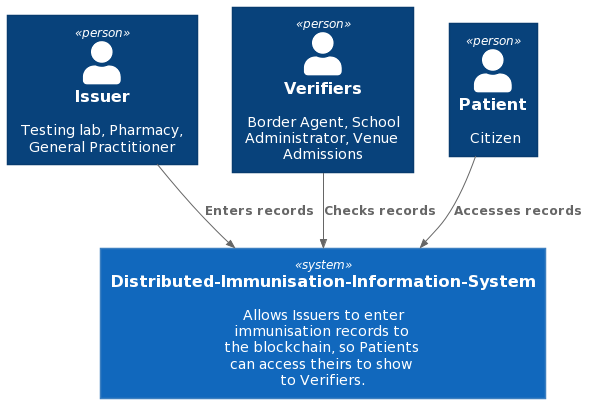
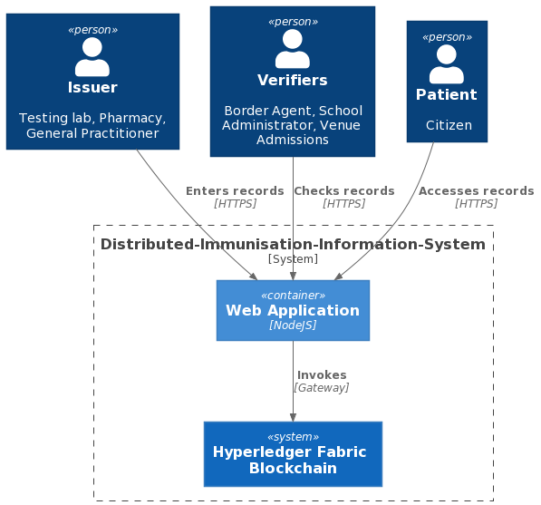
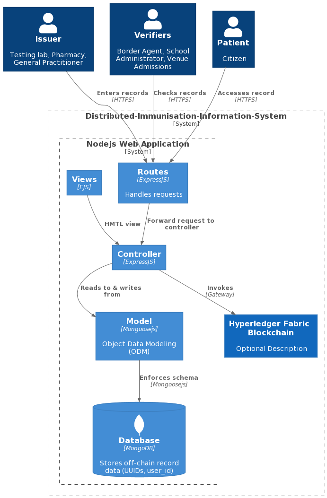

# Distributed Immunisation Information System
Repository of resources used and produced during the development of a basic Distributed Immunisation Information System (DIIS), built using Hyperledger Fabric, for my dissertation.

The project was produced as a proof of concept for an internationally available store of immunisation records. Records are represented with smart contracts (chaincode in Hyperledger Fabric), which is also invoked from a web application using Fabric's APIs to manipulate the ledger. 

[Click here for the full report](draft/main.pdf "Report writeup").

## System Context

## Container View

## Component View
